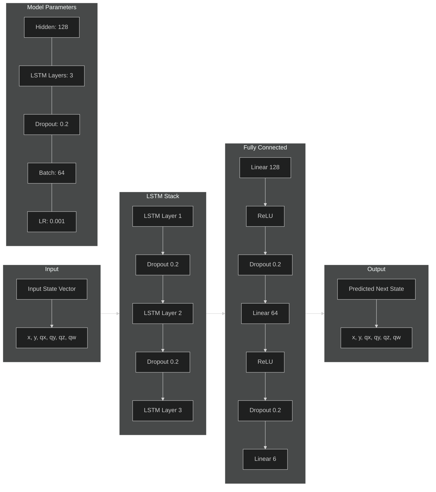
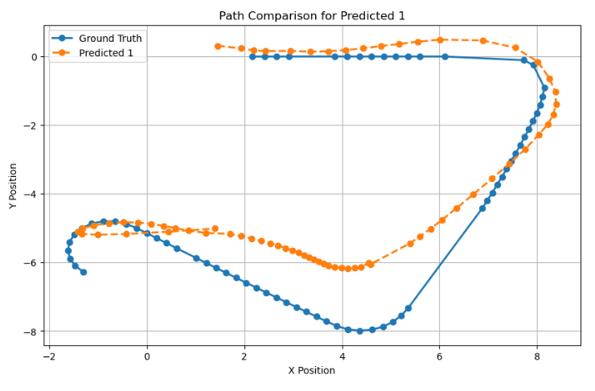

# Project 1: Learning the Kinematic Model of a Mobile Robot

For this task the MIR 100 Robot was loaded into a Gazebo World, with several nodes to enable autonomous exploration of the robot.

## MIR 100 Robot Simulation in Gazebo

This document provides instructions to simulate the MIR 100 robot in the `10by10_maze.world_1.xml` Gazebo environment.

### Setup Overview

- The simulation uses the `10by10_maze.world_1.xml` file in Gazebo.
- Gazebo and RViz are combined into a single launch file.
- Nodes are included in a separate launch file for modularity.

### Steps to Start the Simulation

1. ****Navigate to the Launch Directory****: Go to the directory containing the launch files.
   ```bash
   cd /CATKINWS/src/project1/launch
2. ****Start the Simulation****: Run the provided script to initialize the simulation.
   ```bash
   ./start_simulation.sh
3.  ****Set the Robot's Route****: Before starting the robot's path-following behavior, define a route by setting the appropriate ROS parameter.
    ```bash
    rosparam set /path_follower/routes "[[[1.0, 1.0]]]"
4. ****Run the Path-Following Script****: Execute the Python script to activate the robot's path-following logic.
   	```bash
    rosrun project1 path_follower.py
    
## **Position Logging**

The **Position Logger** is a custom ROS node (`position_logger.py`) that logs odometry data from the `/odom` topic to a CSV file. This node is critical for collecting motion data, which serves as the foundation for training the kinematic model.

#### **Features of the Position Logger**
1. **Odometry Data Collection**
   - Subscribes to the `/odom` topic, which provides `nav_msgs/Odometry` messages containing:
     - **Position**: The robot's position in 3D space (`x, y, z`).
     - **Orientation**: The robot's rotation represented as a quaternion (`x, y, z, w`).
     - **Linear Velocity**: The robot's velocity in 3D space (`x, y, z`).
     - **Angular Velocity**: The robot's rotational velocity (`x, y, z`).

2. **Data Logging**
   - Logs the above data into a CSV file with the following fields:
     - `timestamp`
     - `x, y, z` (position)
     - `orientation_x, orientation_y, orientation_z, orientation_w` (quaternion orientation)
     - `linear_velocity_x, linear_velocity_y, linear_velocity_z` (linear velocities)
     - `angular_velocity_x, angular_velocity_y, angular_velocity_z` (angular velocities)

3. **Dynamic Configuration**
   - Accepts parameters via the launch file:
     - `robot_name`: Specifies the robot being monitored (default: `mir_100`).
     - `output_file`: Specifies the path to save the CSV log (default: `/tmp/position_log.csv`).
   - If the output directory does not exist, it is created automatically.

4. **Rounding**
   - Rounds all numerical values to three decimal places for cleaner and more compact logs.

## **LSTM Model**
#### **Architecture & Training Params**

#### **Why LSTM**? 

- Maintain long-term memory through cell state, ideal for tracking robot motion patterns
- Selective information flow via gates prevents vanishing/exploding gradients
- Better handle temporal dependencies compared to standard RNNs
- Can forget irrelevant information while retaining crucial past states
- Naturally suited for variable-length sequences in trajectory prediction
- Parallel processing of sequential data through gates improves training efficiency


## Evaluation

The kinematic model for the MIR 100 robot was evaluated using positional and orientation errors, as well as trajectory comparisons.



### Quantitative Metrics for one Trajectory
- **Position Error**:
  - Mean Absolute Error (MAE): **1.2943 meters**
  - Root Mean Squared Error (RMSE): **1.5964 meters**
- **Orientation Error**:
  - Mean Absolute Error (MAE): **2.6769 radians**
  - Root Mean Squared Error (RMSE): **2.6926 radians**

### Observations
1. **Error Analysis**:
   - Position and orientation errors show spikes during sharp turns and complex navigation sections but remain within acceptable limits in most cases.


2. **Trajectory Comparison**:
   - Some Dropouts in the logging increase the error, when data is only sparsely provided.
   - Once the Trajectory is of path it doesnt catch up but one can see that it follows the same path but with an offset

### Conclusion
The model performs well at high loggging rates, demonstrating its ability to accurately predict robot motion in dynamic environments. However, future improvements could focus on handling the data collection.
